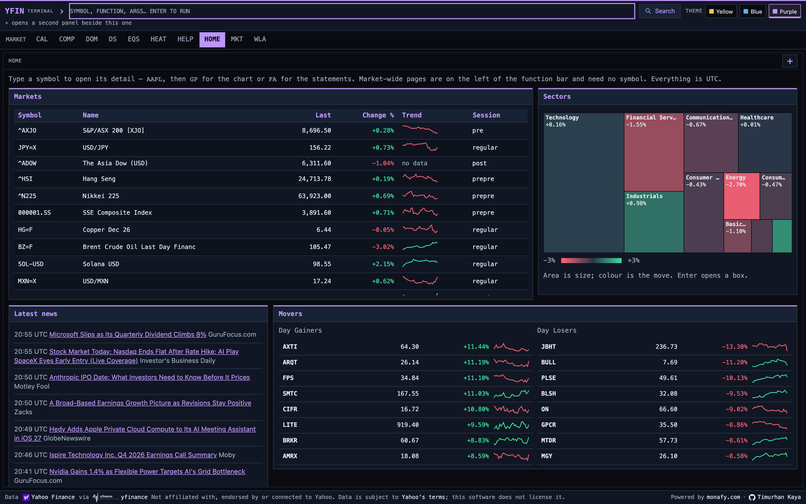
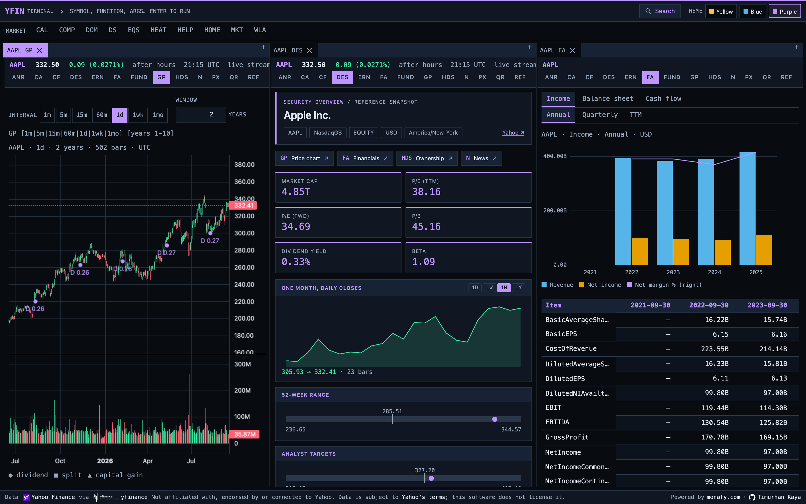

# yfin

A production-grade ingestion pipeline that pulls the full Yahoo Finance
surface into PostgreSQL 18 + TimescaleDB, and keeps it correct.

Open source under **AGPL-3.0-or-later**. The licence covers the
software, not Yahoo Finance data — see
[Data source and terms](#data-source-and-terms). Self-hosting is the
supported way to run it; [hosted operation](#hosted-operation) means
someone running *your* instance, not a shared Yahoo feed.



*`/ui` after `yfin sync`, `market sync`, `screen sync` and `domain sync`
against the compose stack.*



*`/ui/w/-` after `AAPL GP`, `+`, then `AAPL DES` and `AAPL FA` with
Ctrl+Enter — the stream on. See [Web terminal](#web-terminal).*

---

## Name

**yfin** is the project, the Python distribution (`pip install yfin`), the
importable package (`import yfin`) and the CLI (`yfin sync`). One name in
all four places, on purpose.

It is deliberately *not* `yfinance`. **yfinance** is
[ranaroussi/yfinance](https://github.com/ranaroussi/yfinance) — a separate,
independently maintained project that yfin depends on and does not fork,
vendor or replace. yfin is not affiliated with or endorsed by it, nor by
Yahoo.

| | yfinance | yfin |
|---|---|---|
| Owner | [ranaroussi](https://github.com/ranaroussi/yfinance) | this project |
| Job | talk to Yahoo, return DataFrames | normalise, persist, verify, audit |
| Output | in-memory objects | PostgreSQL 18 + TimescaleDB tables |
| State | none | watermarks, run audit, gap ledger, split-adjustment ledger |
| Licence | Apache-2.0 | AGPL-3.0-or-later |

Docs for the upstream library: <https://ranaroussi.github.io/yfinance/>.

---

## What it actually does

`yfinance` gives you DataFrames. yfin gives you a **queryable, auditable,
incrementally-maintained archive**:

- **61 datasets** writing 68 tables — 49 per-symbol, 7 market-wide, 5
  sector/industry: prices, fundamentals, analyst estimates, ownership,
  funds, news, filings, taxonomy, market calendars, screeners. `yfin
  datasets` lists 72 names because aliases (`bars`, `actions`,
  `financials`, `analysis`, …) expand to several datasets each.
  The schema holds 91 tables; the other 23 are infrastructure — the run
  audit (2), the scheduler's own audit and per-shard counters (2), the
  proxy pool, the settings store, the intraday scope and rescale ledgers,
  the pipeline change outbox and its cursor (2), the five API client/plan
  tables and the eight live-stream tables.
- **Intraday bar archive.** Yahoo drops 1-minute data after 29 days. The
  pipeline stores it before that happens, and records the gaps it could
  not fill so "no data" and "we missed it" stay distinguishable.
- **Every write is verified.** Row counts come from reading the keys back,
  not from the driver's affected-row count.
- **Every run is audited.** `sync_runs` / `sync_run_items` record the
  outcome of every (symbol × dataset) cell: `ok`, `empty`, `skipped`,
  `out_of_scope` or `failed` with the error.
- **Incremental by default.** Watermarks per symbol and interval;
  content-hash gates so unchanged data is not rewritten.
- **Proxy pool** with health tracking, cooldown and encrypted
  credentials, plus sharded parallel runs.

Design decisions are backed by measurements, not guesses — see
[`docs/measurements/`](docs/measurements/).

---

## Quick start

```bash
git clone <repo> && cd yfin
uv sync --extra dev --extra api --extra scheduler   # same resolver and lock as CI and the image

cp .env.example .env        # set DB_PASSWORD at minimum
# Five services: PostgreSQL 18.6 + TimescaleDB 2.29.2, Redis (API rate
# limit and quota counters), the API, a single-node Kafka broker for the
# relays, and the `scheduler` (replaces cron), which carries
# `restart: unless-stopped` so the pipeline runs for as long as Docker
# does. `docker compose up -d timescaledb` is enough if you only want a
# database to sync into by hand.
docker compose up -d

# The live `stream` and the two Kafka relays are opt-in, because each
# refuses to start while its feature flag is off:
#   docker compose --profile stream --profile kafka up -d

uv run yfin db create
uv run yfin db upgrade head

uv run yfin symbols add AAPL MSFT
uv run yfin sync --symbols AAPL
```

A single-symbol full sync of AAPL wrote 37,295 verified rows across 36
tables. The spread is real: SPY, an ETF, wrote 30,248 rows across 18 —
an ETF has no income statement and a stock has no fund holdings, and
`sync_run_items` records the difference as `empty`, not as failure.

### Common commands

```bash
yfin sync                         # every active symbol, every dataset
yfin sync --datasets history,info # a subset
yfin sync --exchange NMS          # filter the universe
yfin market sync                  # market-wide (calendars, status, summary)
yfin domain sync                  # sector / industry taxonomy
yfin scope add AAPL --interval 1m # opt a symbol into the 1m archive
yfin bars gaps                    # unfilled intraday windows
yfin bars rescale --seed          # baseline the split-adjustment ledger
yfin config list                  # effective settings and their source

yfin stream scope add AAPL        # opt a symbol into the live tick stream
yfin stream run                   # ingest Yahoo's pricing socket
yfin stream relay                 # publish stream_outbox to Kafka
yfin stream status                # connection health, scope, relay lag

yfin scheduler jobs               # every job, its cron and its next firing
yfin scheduler run                # the process that replaces cron
yfin changes relay                # publish pipeline_outbox to Kafka
yfin changes status               # change-event lag, and what is holding it
yfin prune --audit-days 3         # bound the audit tables (see below)
```

### Monitoring

```bash
docker compose -f docker-compose.yml -f docker-compose.observability.yml \
  --profile observability up -d
```

Prometheus, Grafana, Loki, Tempo and Alloy, plus a Postgres and a Redis
exporter running inside the collector. Copy
`deploy/observability/.env.example` to `.env` beside it first — Grafana's
admin password has no default, and the read-only database role the
exporters log in as is created by `yfin db monitor-role
--password-env MONITOR_DB_PASSWORD`.

Grafana is on `${GRAFANA_PORT:-3000}` with five provisioned dashboards
(Overview, Sync, Freshness, Bars, Stream and API) and thirteen alert
rules. **Every alert threshold in
`deploy/observability/grafana/provisioning/alerting/rules.yml` is a
starting value, not a measurement** — a month of real data is what
replaces them.

The second `-f` is not optional. `scheduler` and `stream` live in the
base file so the pipeline runs without the monitoring stack, but their
`METRICS_PORT` and `LOG_FORMAT` come from the override; started with one
`-f` they run fine and publish nothing. Setting
`COMPOSE_FILE=docker-compose.yml:docker-compose.observability.yml` in
`.env` makes both the default.

Retention is a requirement here, not a nicety: the freshness query the
exporter runs every five minutes costs 2.35 s over three nights of audit
history and 4.89 s over seven, against a 5 s budget. `yfin prune
--audit-days N` is what bounds it — see
[`docs/measurements/observability.md`](docs/measurements/observability.md).

### Web terminal

```bash
cd web && npm ci && npm run build   # writes src/yfin/ui/static/dist
YFAPI_UI_ENABLED=true uvicorn yfin.api.app:app --port 8000
open http://localhost:8000/ui
```

Dockview workspaces are enabled by default. Set
`YFAPI_DOCKVIEW_ENABLED=false` in `.env` for a single-panel terminal.
Apply changes with `docker compose up -d --no-deps --force-recreate api`
(or restart a locally running API). This is a runtime setting; no frontend
rebuild is needed after the initial deployment. Disabled workspaces redirect
to `/ui`; existing saved layouts remain in browser storage. The Pages manager
is hidden from navigation, search and help.

Open Watchlist (`WLA`) to add symbols using the input and remove them with
the row buttons. The list is kept in its shareable URL, so bookmark it to
return later. A streamed quote takes priority; otherwise the last archived
daily close and its daily change are shown with an `archived close` label.

The terminal is public: there is no login and no identity of any kind.
The page reads the archive through its own mirror of the `/v1` routers
at `/ui/api/v1` (no Bearer token, no plan metering, a per-address brake
of `YFAPI_UI_REQUESTS_PER_MINUTE` requests instead). `/v1` itself and
its `openapi.json` do not change. Behind a reverse proxy set
`YFAPI_TRUSTED_PROXIES`, or every browser in the world shares one brake
bucket -- that brake is the only thing in front of the terminal, so it
is what makes the setting matter. The footer credits Yahoo Finance and
`yfinance`, states that the project is not affiliated with Yahoo, and
links Yahoo's terms: the software does not licence the data.

Use `npm ci` in `web/`; plain `npm install` crashes on the npm that
ships with Node 22 (an npm 10.9 resolver bug) -- the committed
lockfile is the source of truth.

`/ui` is the home: market status, the screens that ran today, and the
way in by symbol. From there the terminal has two kinds of page, and the
URL says which is which -- a screener is not a property of a symbol:

| Shape | What it is | Example |
|---|---|---|
| `/ui` | the home | |
| `/ui/m/{FUNCTION}` | market-wide, no symbol in the address | `/ui/m/EQS`, `/ui/m/WLA?symbols=AAPL,MSFT` |
| `/ui/t/{SYMBOL}/{FUNCTION}` | one symbol's detail | `/ui/t/AAPL/GIP?interval=5m` |

The strip's symbol still follows you across a market page -- `AAPL`,
then `EQS`, then `FA` lands back on Apple -- but it rides in the history
entry rather than the path, so a `/ui/m/EQS` link you paste to someone
carries no one's symbol. Clicking a row in a screener or a watchlist
opens that symbol's detail.

The command box reads `[SYMBOL] [FUNCTION] [ARGS]`; a bare symbol keeps
the current function, a bare function keeps the current symbol:

```bash
AAPL                  # description (DES) of a symbol
FA balance quarterly  # statements: income|balance|cash, annual|quarterly|ttm
ANR                   # analyst ratings on the current symbol
N                     # news; j/k to move, Enter to open
CF 10-K               # SEC filings of one type; Enter expands exhibits
GP                    # daily candles, two years, dividends and splits marked
GIP 5m                # intraday candles; the archive's gaps are shaded
QR                    # time and sales: the last ticks, then live
WLA AAPL MSFT NVDA    # a live watchlist; the list is the URL, so it is shareable
EQS                   # every screen this deployment runs; Enter opens one
EQS day_gainers       # what it matched, in the screen's own order
HELP                  # every function and shortcut; Esc goes back
```

Times are UTC everywhere -- axes, tooltips, tables and the strip -- and
labelled as such. The archive keys everything by UTC, so a terminal in
another city reads the same numbers.

`GIP` shades the windows the archive knows it is missing. An hour with
no candles otherwise means two very different things, a closed market or
a missed fetch, and only `bar_gaps` can tell them apart; without the
shading the chart draws a continuous line across a hole.

### Live prices in the browser

Off by default. Two settings turn it on, and they are deliberately on
different sides: the switch is DB-managed, the Redis URL is env-only
because it carries a credential.

```bash
yfin config set yf_stream_publish_enabled true
export YF_STREAM_PUBLISH_REDIS_URL=redis://localhost:6379/2   # both processes
```

`yfin stream run` publishes each committed batch to `yfin:tick:{SYMBOL}`,
after the transaction, never before; the API subscribes an open page to
the symbols it is looking at over `/ui/ws`. Every failure on that path is
swallowed, counted (`yfin_stream_publish_total{result}`) and logged once
per outage: a browser that misses a tick repaints on the next one, and
the archive is the writer's commit, which has already happened.

With it off -- or with Redis unreachable, or for a symbol outside
`yfin stream scope` -- the terminal says so rather than showing a price
that will never move, and every REST panel works as before.

### Admin page

```bash
YFAPI_ADMIN_PASSWORD=<choose one> uvicorn yfin.api.app:app --port 8000
open http://localhost:8000/admin
```

Four server-rendered pages, no JavaScript: the `settings` table (every
DB-managed setting with its schema, source and effective value; Save
validates through the same store `yfin config set` uses, Unset drops the
row), the proxy pool (add with the `yfin proxy add` DSN form, credentials
Fernet-encrypted; enable, disable, reset health, remove), which screens
run, and a read-only list of API clients. The routes exist only while
the variable is set. Access is HTTP Basic (the browser's own prompt;
any username, the secret is the credential), with five failed attempts
per address per minute before a 429. Put it behind TLS: Basic carries
the secret on every request.

---

## Integration status

### Data sources

Every row below is fetched through
[`yfinance`](https://github.com/ranaroussi/yfinance) — that library owns
the HTTP calls, the endpoint quirks and the price-repair logic. yfin owns
what happens after the DataFrame: normalisation, upsert, verification and
audit. When Yahoo breaks something, the fix usually belongs upstream.

| Integration | Status | Notes |
|---|---|---|
| Yahoo Finance — prices & history | **Stable** | `history`, `dividends`, `splits`, `capital_gains`, `shares_full`, `history_metadata` |
| Yahoo Finance — intraday bars | **Stable** | `1m`/`5m`/`15m`/`60m` hypertable; `1wk`/`1mo` in a separate table |
| Yahoo Finance — fundamentals | **Stable** | income / balance / cashflow, annual + quarterly + TTM, valuation measures |
| Yahoo Finance — analyst data | **Stable** | recommendations, upgrades/downgrades, price targets, EPS trend & revisions, growth & earnings estimates |
| Yahoo Finance — ownership | **Stable** | institutional, mutual fund, insider transactions/roster/activity, major holders |
| Yahoo Finance — funds | **Stable** | profile, metrics, weightings, top holdings |
| Yahoo Finance — news & filings | **Stable** | `news`, `news_symbols`, `sec_filings`, `sec_filing_exhibits` |
| Yahoo Finance — sector/industry | **Stable** | taxonomy, metrics, rankings, research reports |
| Yahoo Finance — market calendars | **Stable** | earnings, economic, IPO, splits; market status & summary |
| Yahoo Finance — search & lookup | **Opt-in** | `--datasets search,lookup`; excluded from `all` because they add ~2 requests/symbol |
| Yahoo Finance — screener | **Opt-in** | `--datasets screener` |
| Yahoo Finance — ESG / sustainability | **Opt-in, off by default** | Returned empty for 19 of 19 symbols tested |

### Infrastructure

| Integration | Status | Notes |
|---|---|---|
| PostgreSQL 18 | **Stable** | `postgresql+psycopg` (psycopg 3) |
| TimescaleDB 2.29 | **Stable** | Hypertables for `price_bars` and `price_history` |
| Alembic migrations | **Stable** | Single squashed baseline; `revision --autogenerate` must produce an empty diff |
| Docker Compose | **Stable** | Five services by default (database, Redis, API, Kafka, scheduler), the `stream` under its own profile and the two relays under the `kafka` profile; every image pinned, tuned `max_connections`. The scheduler and stream disable the image's API healthcheck and get a probe on their own `/metrics` port from the observability override. |
| Proxy pool | **Stable** | HTTP/HTTPS/SOCKS5, Fernet-encrypted credentials, health & cooldown. One OS process per proxy, so a full pass over the universe divides by the pool size — the measured 176 symbols/hour on a single IP is what makes this the lever for freshness at scale. |
| Scheduler | **Stable** | `yfin scheduler run` replaces cron: seven jobs, two executors (a single-threaded `yahoo` queue so nothing splits one IP's rate budget), per-job misfire grace derived from the cron's own cadence, and a `scheduler_runs` row per firing — including the ones that never became a subprocess. Exit codes map to `ok`/`partial`/`locked`/`failed`, so a job that merely collided with another is not reported as a failure. |
| Metrics, logs, traces | **Stable** | Prometheus + Grafana + Loki + Tempo + Alloy under `--profile observability`. A daemon thread in the scheduler turns nine database queries into gauges every five minutes so a scrape never touches a connection; every process renders one JSON log line through one redacting chain; four hand-drawn spans cover the boundaries the automatic instrumentation cannot see. Costs are measured in [`docs/measurements/observability.md`](docs/measurements/observability.md). |
| Sharded parallel sync | **Stable** | Process-per-shard, advisory-lock guarded |
| Settings in database | **Stable** | 73 settings overridable at runtime across 14 groups; `yfin config`. Eleven more are env-only, because they are read before a database exists. |
| CI | **Stable** | GitHub Actions: ruff, `mypy --strict`, pytest, an OpenAPI contract diff, a change-event schema diff, a live tick-field diff, and `promtool` / `alloy fmt` / `docker compose config` over the deploy files through their pinned images; a second job runs `-m repo` and `alembic check` against a pinned PostgreSQL 18 + TimescaleDB service; a third builds the web terminal |
| Compression / retention policies | **Not enabled** | Deliberate: the rescale path rewrites historical rows. Needs measurement first. |
| Continuous aggregates | **Not enabled** | Out of scope so far |

### Planned

| Integration | Status | Notes |
|---|---|---|
| **Read-only HTTP API** | **In progress** | FastAPI, OAuth2 `client_credentials`, scopes derived from data families, rate limiting and quota metering. Client management via `yfin api client`. Self-service signup and billing are separate subsystems and out of scope for now. |
| **Kafka producer** | **In progress** | Live ticks publish through a transactional outbox: `stream_outbox` is written inside the tick transaction, and `yfin stream relay` drains it to Kafka in `id` order, advancing `stream_relay_offset` only after every delivery is acknowledged. **Topic per exchange, partition key per symbol** — a topic per symbol would take the broker's metadata down, a single topic would give up per-exchange isolation, and keying on the symbol is what makes ordering per-symbol. The contract is at-least-once; consumers dedupe on `live_ticks`' primary key. Off by default (`yf_kafka_enabled`), and `confluent-kafka` is an extra (`pip install "yfin[kafka]"`). Publishing *pipeline* writes — as opposed to ticks — is not started. |
| **WebSocket streaming** | **In progress** | Ingest side is complete and driven from `yfin stream`: `run` (single asyncio loop, 100 symbols per connection), `relay`, `status`, `reconcile`, and `yfin stream scope add/disable/list`. `src/yfin/stream/` holds connection, protocol, supervisor, topology, writer, repository, reconcile, relay and kafka; 8 tables (`live_ticks`, `live_quotes`, `stream_scope`, `stream_outbox`, `stream_relay_offset`, `stream_rejects`, `stream_sessions`, `stream_connection_health`), with measurements in [`docs/measurements/websocket.md`](docs/measurements/websocket.md). `yfin stream reconcile` fills open 1m bar gaps from the tick archive, which matters most for `retention_expired` windows Yahoo can no longer serve. The outbound socket is started for the browser terminal: `stream/publish.py` fans committed ticks out over Redis pub/sub and `/ui/ws` subscribes an open page to the symbols it is looking at. A public `/v1` socket for API clients is not started. |
| **Web terminal** | **In progress** | Keyboard-first browser UI under `/ui`, served by the API process. Public by default. Every dataset in the archive is readable: `DS` browses the whole catalogue, `DES`/`FA`/`ANR`/`N`/`CF`/`CA`/`PX` and the tabbed `HDS`/`ERN`/`FUND`/`CAL`/`MKT`/`SCR`/`SRCH`/`DOM`/`REF` panels cover it by family; `GP`/`GIP` chart it, `QR` is the tape, live over a WebSocket when the stream is publishing, `EQS` reads the screeners and `WLA` is a live watchlist. |

---

## Architecture

```
cli/          typer command groups
  |
pipeline/     runner, shard, prune, market/domain runners
              audit (sync_runs + exit code), persist (one symbol =
              one transaction), turn, readers, payload
  |
datasets/     one module per dataset: fetch -> normalize -> upsert
  |           (imports no SQLAlchemy; enforced by a test)
storage/      contracts, engine, upsert mechanics, rescale, settings
  |
models/       SQLAlchemy models, type factories, views

core/         config, errors, logging, normalisation, data families
ingest/       upstream client and screen definitions
proxy/        pool, health, encrypted credentials
api/          read-only HTTP API (FastAPI): auth, rate limit, routers
stream/       live tick ingest: connection, protocol, topology, supervisor,
              writer, repository; reconcile (ticks -> 1m gaps) and
              relay + kafka (outbox -> broker) run as separate processes
```

The dataset layer depends on the protocols in `storage/contracts.py`
(`RowWriter` for writes, `VariantState` for the little stored state a
dataset needs to read), never on SQLAlchemy. That boundary is why
migrating the engine touched none of the 20+ dataset modules, and
`tests/unit/test_dataset_layer_boundary.py` fails the build if a dataset
module imports the ORM again.

Datasets declare what they produce and which **family** they belong to.
The registry resolves names, expands aliases and topologically orders
dependencies; the API derives its authorisation scopes from the same
family declaration, so registering a dataset does not mean editing a
scope map somewhere else.

### Layout

| Path | Contents |
|---|---|
| `src/yfin/cli/` | Command groups: `app`, `bars`, `settings`, `api`, `stream` |
| `src/yfin/core/` | Config, errors, logging, normalisation, data families |
| `src/yfin/ingest/` | Upstream client, screen definitions |
| `src/yfin/datasets/` | One module per dataset; storage-agnostic |
| `src/yfin/pipeline/` | Orchestration, sharding, pruning; `audit`, `persist`, `turn`, `readers` split by reason to change |
| `src/yfin/storage/` | Write contract, engine, upsert, rescale, settings store |
| `src/yfin/models/` | SQLAlchemy models, type factories, views |
| `src/yfin/proxy/` | Pool, health, encrypted credentials |
| `src/yfin/api/` | Read-only HTTP API |
| `src/yfin/stream/` | Live WebSocket tick ingest, bar reconciliation, Kafka outbox relay |
| `src/yfin/ui/` | Web terminal: the public `/ui/api` mount, its own read routes, SPA pages |
| `web/` | The SPA source (React + Vite); builds into `src/yfin/ui/static/dist` |
| `migrations/` | Alembic |
| `docs/measurements/` | Evidence behind the design decisions |

---

## Development

```bash
uv run ruff check .
uv run mypy                      # --strict, from pyproject.toml
uv run pytest                    # unit tests, no database, no network
uv run pytest -m repo            # against a real PostgreSQL + TimescaleDB
uv run pytest -m live            # against the real Yahoo API
```

Unit tests reach nothing outside the process, and that is enforced
rather than assumed: `tests/unit/conftest.py` fails any test that opens a
non-loopback connection. `-m repo` tests create a schema per process, so
parallel runs cannot collide.

CI (`.github/workflows/ci.yml`) runs the same commands on every push and
pull request, then the three contract locks (`scripts/dump_openapi.py`,
`scripts/dump_change_schema.py`, `scripts/dump_tick_fields.py --check`),
the observability config checks, `-m repo` plus `alembic check` against a
pinned TimescaleDB service, and the web `check`/`lint`/`test`/`build`.

**Conventions**

- Comments follow `CLAUDE.md`: at most 3-5 lines, only a non-obvious
  constraint or invariant, never a measurement or an investigation. Measured
  claims belong in `docs/measurements/` and in commit messages.
- New tables must satisfy the schema invariants in
  `tests/unit/test_schema_invariants.py` — FK policy, timestamp
  precision, collation, as-of key ordering.
- `alembic revision --autogenerate` must produce an empty diff before a
  change is considered done.

---

## Data source and terms

Neither this project nor [yfinance](https://github.com/ranaroussi/yfinance)
is affiliated with, endorsed by, or connected to Yahoo. Attribution in
the terminal footer is a source credit, not a licence.

The **software** is open source under AGPL-3.0-or-later. Yahoo Finance
**data** is not. It remains subject to
[Yahoo's Terms of Service](https://legal.yahoo.com/us/en/yahoo/terms/otos/index.html)
and to the licences of the exchanges and vendors Yahoo displays (LSEG,
OTC Markets, and others). Yahoo prohibits automated collection without
express prior permission and prohibits redistribution of that
information.

- **You may** publish, fork and host the source code, and run the
  software on your own machine against your own access.
- **You may not** treat a public website or API that serves
  Yahoo-derived quotes, fundamentals or news as licensed by this
  repository. A disclaimer does not grant redistribution rights.
- Compliance with Yahoo's terms and with exchange or vendor licences is
  the operator's responsibility.

---

## Production deployment

The supported production target is Docker Compose on one host; the
image is the same one `docker compose up` builds locally.

```bash
cp .env.example .env
# Required: DB_PASSWORD, YFAPI_JWT_SIGNING_KEY (`openssl rand -base64 48`).
# Behind a TLS proxy: YFAPI_TRUSTED_PROXIES and YFAPI_PUBLIC_BASE_URL.
# Optional: YF_PROXY_SECRET_KEY (proxy pool), YFAPI_ADMIN_PASSWORD (/admin),
# YFAPI_UI_ENABLED (public terminal), YFAPI_DOCS_ENABLED.
docker compose up -d --build
docker compose exec api yfin db create
docker compose exec api yfin db upgrade head
docker compose exec api yfin config seed        # config/settings.seed.json
docker compose exec api yfin symbols add AAPL MSFT
docker compose exec api yfin stream scope add AAPL MSFT
docker compose exec api yfin config set yf_stream_enabled true
docker compose --profile stream up -d                    # the stream exits while the flag is off
docker compose exec api yfin api client create --name <name> --owner-email <email>
curl -fsS http://localhost:8000/health/ready     # {"status":"ok","database":"ok","redis":"ok"}
```

Monitoring is the `observability` profile with `deploy/observability/.env`
filled in (see "Monitoring"). Upgrades are `git pull`, the same
`up -d --build`, and `yfin db upgrade head`; take the backup below
first, because a rolled-back image does not roll back the schema. The
archive lives in the `yfin-pgdata` volume — back it up
with `docker compose exec timescaledb pg_dump -U yfin -d yfinance -Fc`.
Terminate TLS in front of the API; nothing in the stack serves it.

---

## Hosted operation

The pipeline is free to self-host and always will be. Self-hosting is
not a degraded tier: it is the same code, the same schema, and the same
migrations. Running it well means a database you maintain and enough
proxies that a full pass finishes inside its own cadence. The scheduler
ships here; the IPs do not, and on one address a 5,888-symbol universe
takes 33 hours per pass against a nightly window of 24.

A hosted offering, if any, is managed operation of **your** instance
against **your** access — not a shared Yahoo-derived data feed. This
repository does not sell or relicence Yahoo's data.

---

## Credits

- **[yfinance](https://github.com/ranaroussi/yfinance)** by Ran Aroussi
  (Apache-2.0) — the client library every Yahoo request in this project
  goes through. Documentation:
  <https://ranaroussi.github.io/yfinance/>.

---

## Licence

**GNU Affero General Public License v3.0 or later** — see
[`LICENSE`](LICENSE).

AGPL was chosen because the terminal and API are used over a network.
In practice:

- **Self-hosting, internally**: use the software however you like.
  Running it for your own analysis, inside your company, triggers
  nothing under AGPL.
- **Modifying it**: your changes are AGPL too, and you must offer the
  source to anyone you distribute the software to.
- **Offering it as a network service**: section 13 applies. If you run a
  modified version and let others interact with it over a network, you
  must offer those users its source. That clause is about the software,
  not about Yahoo's data: AGPL does not authorise redistribution of
  the upstream feed.

Contributions are accepted under the same licence. If AGPL does not work
for your use case, ask about a commercial licence.
